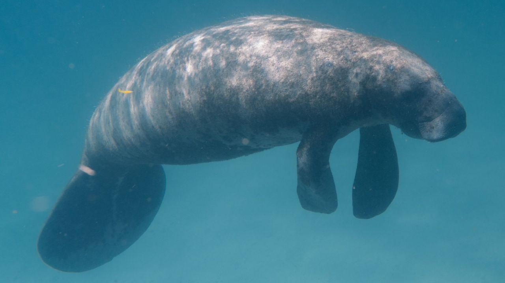

# llama.cpp

## To-Do
- [x] Eval [Perplexity](#perplexity-measuring-model-quality)
- [ ] [Constraint output](#constrained-output-with-grammars)

## Recent changes

- [2024 Jun 26] [PR #8006](https://github.com/ggerganov/llama.cpp/pull/8006) (Change to my PR)

## Models

- [LLaMA 2 🦙🦙](https://huggingface.co/meta-llama/Llama-2-7b-chat-hf)
- [LLaMA 3 🦙🦙🦙](https://huggingface.co/meta-llama/Meta-Llama-3-8B)
- [LLaMA 3.1 🦙🦙🦙](https://huggingface.co/meta-llama/Meta-Llama-3.1-8B-Instruct)

## Usage

### Basic usage

- Method 1: Clone this repository and build locally, see [how to build](./docs/build.md)

Run a basic completion using this command:

    ./llama-cli -m ../models/Meta-Llama-3.1-8B-Instruct/Meta-Llama-3.1-8B-Instruct-Q4_K_M.gguf -p "I believe the meaning of life is" -n -2 -t 12 -c 256 --keep -1

    -n: generate infinite context
        -1: until EOS / timing or memory limit
        -2: until context memory limit

    --mlock                  force system to keep model in RAM rather than swapping or compressing
    --no-mmap                do not memory-map model (slower load but may reduce pageouts if not using mlock)  
    --keep                   keep prompt token (default: 0, -1 = all)

    read memory: smem -r -p -k -t

See [this page](https://github.com/ggerganov/llama.cpp/blob/master/examples/main/README.md) for a full list of parameters.

### Web server

Example usage:

    ./llama-server -m ../models/Meta-Llama-3.1-8B-Instruct/Meta-Llama-3.1-8B-Instruct-Q4_K_M.ggu --host 0.0.0.0 --port 8080  -t 12 -c 256 --keep ?

    # Basic web UI can be accessed via browser: http://localhost:8080
    # Chat completion endpoint: http://localhost:8080/v1/chat/completions

## Tools

### Prepare and Quantize
[Use Models](#models)

    # install Python dependencies
    python3 -m pip install -r requirements.txt

    # convert the model to ggml FP16 format
    python3 convert_hf_to_gguf.py models/mymodel/

    # quantize the model to 4-bits (using Q4_K_M method)
    ./llama-quantize ./models/mymodel/ggml-model-f16.gguf ./models/mymodel/ggml-model-Q4_K_M.gguf Q4_K_M

    # update the gguf filetype to current version if older version is now unsupported
    ./llama-quantize ./models/mymodel/ggml-model-Q4_K_M.gguf ./models/mymodel/ggml-model-Q4_K_M-v2.gguf COPY

### Perplexity (measuring model quality)

* Llama3.1-8B
`./llama-perplexity -f wikitext-2-raw/wiki.test.raw -m ../models/Meta-Llama-3.1-8B-Instruct/Meta-Llama-3.1-8B-Instruct-F16.gguf --kl-divergence-base kld/llama3.1_8B_F16.kld `

| Quantization | Model size [GiB] | PPL                   |
| ------------ | ---------------- | --------------------- |
| f16          | 14.97            | 7.3170 +/- 0.04676    |
| q8_0         | 4.58             | 6.234284 ±   0.037878 |

* Long context perplexity
`./build/bin/llama-long-context-perplexity -f wikitext-2-raw/wiki.test.raw -m ../models/Meta-Llama-3.1-8B-Instruct/Meta-Llama-3.1-8B-Instruct-F16.gguf `

## Other documentations

- [main (cli)](https://github.com/ggerganov/llama.cpp/blob/master/examples/main/README.md)
- [server](https://github.com/ggerganov/llama.cpp/blob/master/examples/server/README.md)

**Source**
- [Llama.cpp](https://github.com/ggerganov/llama.cpp)
